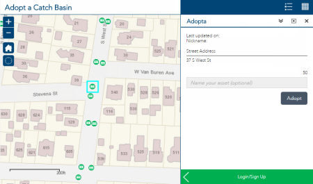

# adopta

AdoptA is is a Web AppBuilder (Developer Edition) custom widget and ArcGIS Server configuration designed to support the public adoption and maintenance of assets.

* [Try the Adopt a Hydrant application](http://links.esri.com/localgovernment/tryit/adoptahydrant/)
* [Try the Adopt a Catch Basin application](http://links.esri.com/localgovernment/tryit/adoptacatchbasin/)
* [Try the Adopt a Park application](http://links.esri.com/localgovernment/tryit/adoptapark/)

## Features
* Preset view of unadopted assests
* Password less authentication through emails
* Email based editing

## Requirements

**Start now by downloading and installing [Web AppBuilder (Developer Edition)](https://developers.arcgis.com/web-appbuilder/) and adding the custom widget**

You can start using the Adopta widget now by adding the "Adopta" folder to 2D widget folder (\WebAppBuilderForArcGIS\client\stemapp\widgets) in Web AppBuilder (Developer Edition) then restarting Web AppBuilder. For additional information use the following steps to deploy a custom widget [Web AppBuilder (Developer Edition) depoly a custom widget](https://developers.arcgis.com/web-appbuilder/guide/deploy-custom-widget-and-theme.htm)

**Start now using your own services, you'll want to publish a Adopta feature service and geoprocessing service when developing. The help below will walk you through this process**

For more information on requirements and publication steps, see [Adopta ](http://links.esri.com/localgovernment/help/adopta/) help.

### Experience

* Using Web AppBuilder (Developer Edition)
* Publishing aervices and authoring maps using ArcGIS Online

### Software
* ArcGIS Online subscription
* Web AppBuilder (Developer Edition)

### Browser Compatibility for the Adopta widget
The application is optimized for display on desktops, tablet, and smartphones devices using the following browsers:
* Microsoft Internet Explorer 10, 11
* Mozilla Firefox
* Google Chrome
* Apple Safari
* Microsoft Edge

## Resources

Additional [information and sample data](http://links.esri.com/localgovernment/download/adopta/) are available for the application.

Learn more about Esri's [ArcGIS for Local Government maps and apps](http://solutions.arcgis.com/local-government/).

Show me a list of other [Local Government GitHub repositories](http://esri.github.io/#Local-Government).

[New to Github? Get started here.](http://htmlpreview.github.com/?https://github.com/Esri/esri.github.com/blob/master/help/esri-getting-to-know-github.html)

## Issues

Find a bug or want to request a new feature?  Please let us know by submitting an issue.

## Contributing

Esri welcomes contributions from anyone and everyone.
Please see our [guidelines for contributing](https://github.com/esri/contributing).

## Licensing

Copyright 2016 Esri

Licensed under the Apache License, Version 2.0 (the "License"); you may not use this file except in compliance with the License. You may obtain a copy of the License at

   http://www.apache.org/licenses/LICENSE-2.0

Unless required by applicable law or agreed to in writing, software distributed under the License is distributed on an "AS IS" BASIS, WITHOUT WARRANTIES OR CONDITIONS OF ANY KIND, either express or implied. See the License for the specific language governing permissions and limitations under the License.

A copy of the license is available in the repository's
[LICENSE.txt](LICENSE.txt) file.
